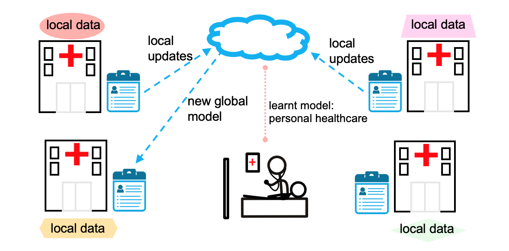

Federated learning is a revolutionary approach that has the potential to significantly impact the healthcare industry. This essay aims to explore the advantages of federated learning in healthcare and its implications for patient care, data privacy, and medical research.

In the context of healthcare, federated learning enables a collaborative model of machine learning where multiple institutions can pool their data for analysis without the need to centrally store the data. This approach ensures that sensitive patient information remains within the original institution's domain, thereby addressing privacy concerns and complying with data protection regulations.

Moreover, federated learning facilitates the development of robust predictive models without exposing raw patient data to unauthorized access. By leveraging the collective knowledge from diverse datasets, healthcare providers can enhance diagnostic accuracy, personalize treatment plans, and predict disease outcomes with greater precision, ultimately leading to improved patient care and outcomes.

From a research perspective, federated learning empowers medical researchers to access a more comprehensive and diverse set of healthcare data, overcoming the limitations of individual institutions' datasets. This broader data pool enables the identification of rare medical conditions, the discovery of new treatment pathways, and the validation of medical hypotheses, ultimately advancing the frontiers of medical science and innovation.

Furthermore, the application of federated learning in healthcare contributes to reducing the geographic disparities in access to specialized medical expertise. By enabling healthcare providers in remote or underserved areas to participate in collaborative data analysis, federated learning promotes equitable healthcare delivery and the democratization of medical knowledge, thus bridging the gap in quality care provision between different regions.

In conclusion, federated learning presents immense potential for transforming the landscape of healthcare by driving advancements in patient care, medical research, data privacy, and equitable access to healthcare services. Embracing federated learning in the healthcare domain holds the promise of revolutionizing clinical practices and catalyzing breakthroughs in medical science. The widespread adoption of federated learning stands to empower the healthcare industry in realizing its overarching mission of delivering high-quality, patient-centric care while upholding the highest standards of data privacy and security.

In summary, federated learning in healthcare is poised to usher in a new era of collaborative and data-driven healthcare delivery, offering transformative benefits for patients, healthcare providers, and medical researchers alike.
